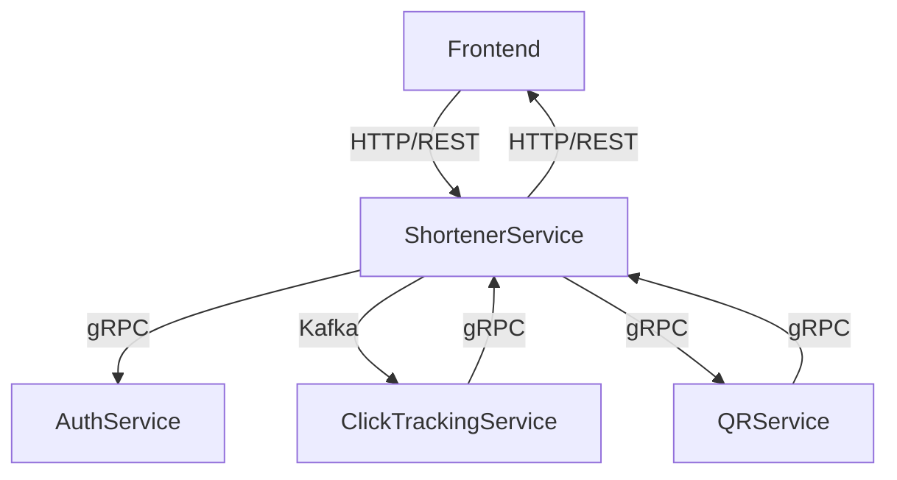

# Архитектура

## Схема архитектуры

## Описание сервисов

### QR-Service

Микросервис, предназначенный для создания, получения и удаления QR-кодов.

Сервис предоставляет API через gRPC интерфейс.

**Основные компоненты**

*QRServer:* Основной сервер, обрабатывающий gRPC запросы.  
Использует QRService для выполнения операций с QR-кодами.

*QRService:* Интерфейс, определяющий методы для работы с QR-кодами.  
Реализация по умолчанию - QRServiceDefault.

*repository.QrRepository:* Интерфейс репозитория для работы с QR-кодами.  
Позволяет создавать, получать и удалять QR-коды.

TODO:  
- [ ] Кэширование
- [ ] Delete Эндпоинт
- [ ] Более подробное логирование
- [ ] Добавить PostgreSQL репозиторий
- [ ] Метрики