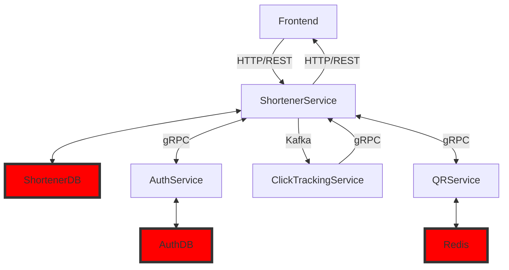

## Схема архитектуры

## Описание сервисов

### QR-Service

Микросервис, предназначенный для создания qr кодов с заданным размером изображения.

Сервис предоставляет API через gRPC интерфейс.

**Основные компоненты**

*QRServer:* Основной сервер, обрабатывающий gRPC запросы.  
Использует QRService для выполнения операций с QR-кодами.

*QRService:* Интерфейс, определяющий методы для работы с QR-кодами.  
Использует кэширование при помощи редиса через интерфейс `cache`.  
Реализация по умолчанию - QRServiceDefault.

### Shortener-Service

Микросервис, предназначенный для генерации ссылок и общения со всеми остальными сервисами.

Предоставляет REST API

## Тесты

Основной функционал покрыт unit-тестами, для запуска необходимо написать

> make test

## База данных

Используемая CLI для миграций - [goose](https://github.com/pressly/goose).

**Команда для миграций:**
> cd migrate && goose postgres "user=postgres password=postgres port=5432 host=localhost dbname=url_shorter sslmode=disable" up

**Подключение к бд через консоль:**
> docker exec -it **container-name** psql -U postgres