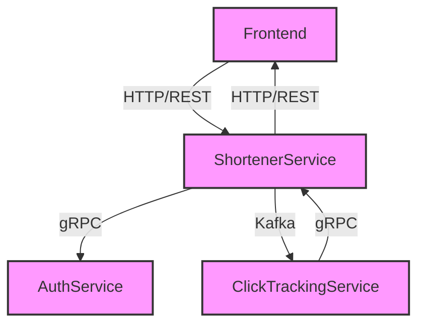

# Архитектура

### Схема архитектуры

```mermaid
graph TD;
    Frontend -->|HTTP/REST| ShortenerService;
    ShortenerService -->|gRPC| AuthService;
    ShortenerService -->|Kafka| ClickTrackingService;
    ClickTrackingService -->|gRPC| ShortenerService;
    ShortenerService -->|HTTP/REST| Frontend;

    classDef default fill:#f9f,stroke:#333,stroke-width:2px;
    class Frontend,ShortenerService,AuthService,ClickTrackingService default;
```