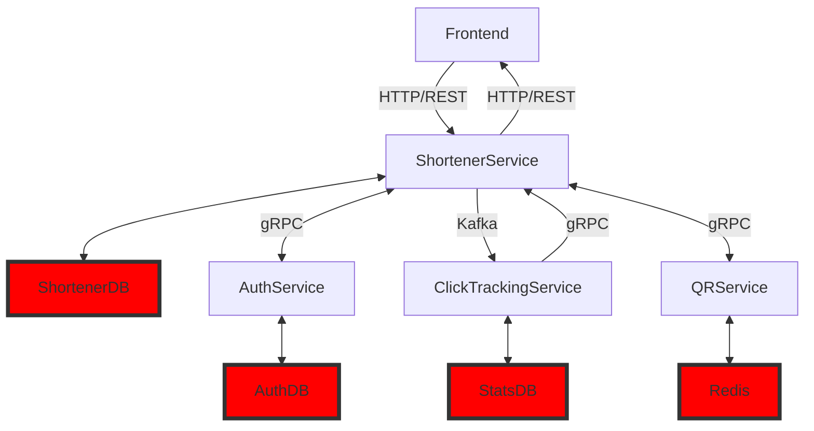

## Запуск сервисов

### Настройка
Настройка приложения осуществляется через переменные среды. 
Для удобства начальной настройки вы можете скопировать содержимое файла `.env-example` в файл `.env`, который будет использоваться при запуске приложения.

### База данных и миграции

Используемая CLI для миграций - [goose](https://github.com/pressly/goose).

**Команда для миграций:**
```bash
cd migrate && goose postgres "user=postgres password=postgres port=5432 host=localhost dbname=url_shorter sslmode=disable" up
```

**Подключение к бд через консоль:**
```bash
> docker exec -it **container-name** psql -U postgres
```

### Запуск с использованием Docker Compose

После настройки переменных среды в файле `.env`, вы можете запустить все необходимые сервисы с помощью Docker Compose. 
```bash
docker-compose up -d
```
После этого все микросервисы должны быть запущены.

Вы можете проверить статус запущенных контейнеров с помощью команды:
```bash
docker-compose ps
```


## Архитектура



## Описание сервисов

### Shortener-Service

Микросервис, предназначенный для генерации ссылок и общения со всеми остальными сервисами.

**Предоставляет REST API:**

1. **Обработка коротких ссылок:**
```
/<short-link>
```
   - **GET**: Перенаправляет пользователя по короткой ссылке.
   - **DELETE**: Удаляет короткую ссылку.
   - **PUT**: Редактирует существующую короткую ссылку.

```
Для DELETE и PUT методов необходимо предоставить `jwt` токен в хедере `Authorization`.
Пользователь может удалять только ссылки, которые были созданы им самим.
```

2. **Создание новой ссылки:**
```
/create-url/
```
    
- **POST:** Создаёт новую ссылку

Тело запроса:
```
{
    "url": string - Ссылка, на которую должна вести новая ссылка,
    "short-url": string - сокращённая ссылка. 
    "expired_at": timestamp - необязательное поле, указывает на момент, с которого ссылка перестанет работать.
}
```

3. **Регистрация:**
```
/register/
```

- **POST:** Регистрирует нового пользователя

Тело запроса:
```
{
    "login": "login",
    "password": "password"
}
```

4. **Логин:**
```
/login/
```

- **POST:** Получение токена

Тело запроса:
```
{
    "login": "login",
    "password": "password"
}
```

В ответ возвращает токен в виде хедера `Authorization`.

5. **Генерация qr-кода:**
```
/qr/<short-link>
```

- **GET:** Получение qr-кода на сокращённую ссылку
    - Имеет get параметр `?size`, который по умолчанию равен 512. Размер указан в пикселях


6. **Получение статистики по ссылке:**
```
/stats/<short-link>
```

- **GET:** Получение статистики по сокращённой ссылке

Тело ответа:
```
{
    "short_link": string - сокращённая ссылка
    "clicks": int - количество кликов по ссылке
    "last_accessed_at": timestamp - время последнего запроса к ссылке
    "unique_clicks": int - количество уникальных кликов
}
```

7. **Метрики Prometheus:**
```
/metrics
```

- **GET:** Получение метрик `Prometheus`.

    
### QR-Service

Микросервис, предназначенный для создания qr кодов с заданным размером изображения.

Сервис предоставляет API через gRPC интерфейс.

Proto файл сервиса: [`qr.proto`](pkg/proto/qr/qr.proto)

### Auth-Service

Микросервис, предназначенный для регистрации пользователей и авторизации при помощи `JWT`-токенов.

Сервис предоставляет API через gRPC интерфейс.

Proto файл сервиса: [`auth.proto`](pkg/proto/auth/auth.proto)

### ClickTrackingService

Микросервис, предназначенный для сбора статистики по ссылкам.

Сервис предоставляет API через gRPC интерфейс.

Proto файл сервиса: [`stats.proto`](pkg/proto/stats/stats.proto)


**Основные компоненты**


## Тесты

Основной функционал покрыт unit-тестами, для запуска необходимо написать
```bash
make test
```
---
