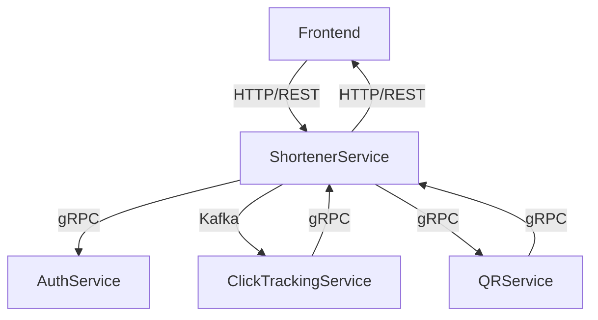

# Архитектура

## Схема архитектуры

## Описание сервисов

### QR-Service

Микросервис, предназначенный для создания qr кодов с заданным размером изображения.

Сервис предоставляет API через gRPC интерфейс.

**Основные компоненты**

*QRServer:* Основной сервер, обрабатывающий gRPC запросы.  
Использует QRService для выполнения операций с QR-кодами.

*QRService:* Интерфейс, определяющий методы для работы с QR-кодами.
Использует кэширование при помощи редиса через интерфейс `cache`.
Реализация по умолчанию - QRServiceDefault.

TODO:

- [X] Кэширование
- [X] Более подробное логирование
